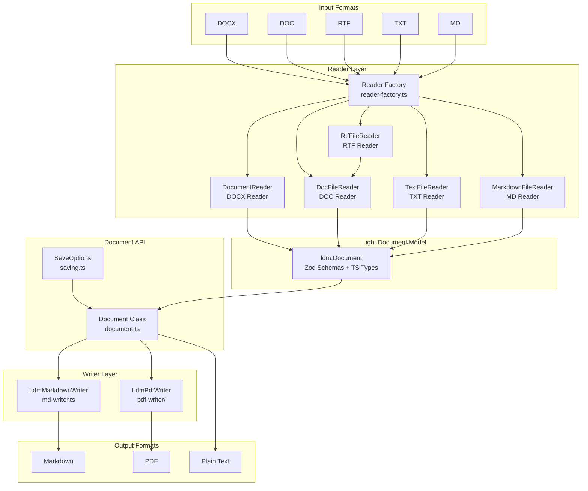
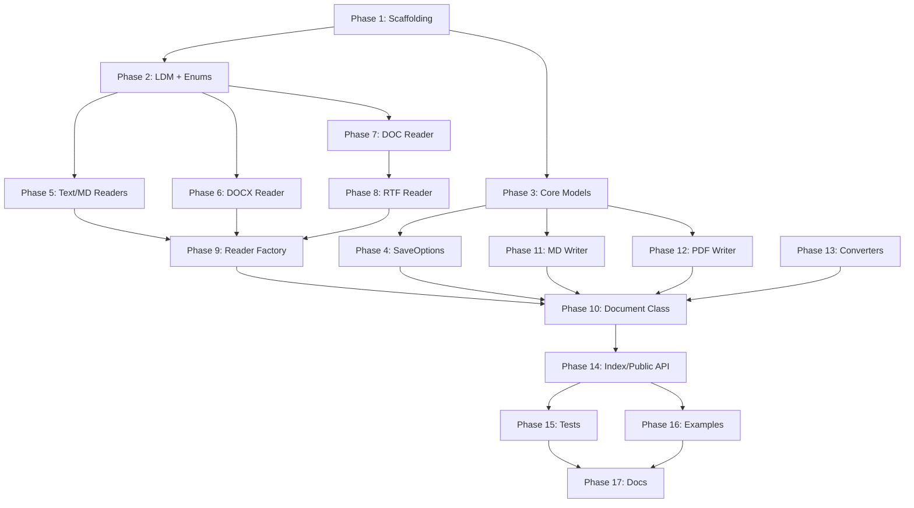

# Migration Plan: Aspose.Words FOSS — Python → Node.js

## Module Name: `tinyweb-office-words`

---

## 1. Executive Summary

Migrate all source code from **Aspose.Words-FOSS-for-Python** (Python 3.10+) to a new Node.js/TypeScript module named **`tinyweb-office-words`**. The library converts DOCX, DOC, RTF, TXT, and MD files to Markdown, plain text, and PDF without requiring Microsoft Word.

---

## 2. Architecture Overview



---

## 3. Dependency Mapping

| Python | Node.js Equivalent | Purpose |
|--------|-------------------|---------|
| `pydantic` (BaseModel, Field, PrivateAttr) | **`zod`** + TypeScript interfaces | Data validation, serialization, model definition |
| `olefile` | **`@ronomon/ole`** or custom `Buffer`-based binary parser | OLE2 compound document parsing (DOC/RTF) |
| `fpdf2` | **`pdfkit`** (primary) or `jsPDF` or `pdf-lib` | PDF generation |
| `zipfile` (stdlib) | **`adm-zip`** or `jszip` | ZIP archive reading (DOCX) |
| `xml.etree.ElementTree` (stdlib) | **`fast-xml-parser`** | XML parsing (DOCX XML) |
| `pathlib.Path` (stdlib) | Node.js **`path`** + **`fs`** | File system operations |
| `dataclasses` (stdlib) | TypeScript **interfaces** / **type aliases** / **classes** | Lightweight data carriers |
| `enum.Enum` / int constants | TypeScript **`const` objects** | Enumeration values |
| `typing.Protocol` (runtime_checkable) | TypeScript **interface** (duck typing) | Reader protocol |
| `typing.Optional`, `Union`, `Iterator` | TypeScript built-in union types, `Generator` | Type annotations |
| `re` (stdlib) | JavaScript **`RegExp`** | Regular expressions |
| `base64` (stdlib) | Node.js **`Buffer`** | Base64 encoding |
| `html` (stdlib) | `html-entities` or manual escaping | HTML escaping |
| `io.BytesIO` (stdlib) | Node.js **`Buffer`** | In-memory byte streams |

---

## 4. Directory Structure

```
tinyweb-office-words/
├── package.json
├── tsconfig.json
├── jest.config.ts
├── .gitignore
├── README.md
├── LICENSE
│
├── src/
│   ├── index.ts                        # Public API exports
│   ├── document.ts                     # Document class + SaveFormat/LoadFormat
│   ├── saving.ts                       # MarkdownSaveOptions, PdfSaveOptions, enums
│   ├── reader-factory.ts              # create_reader() factory
│   ├── models.ts                       # ConversionOptions, RunFormatting, etc.
│   │
│   ├── light-document-model.ts        # Zod schemas + inferred TS types
│   │                                   # (Document, Section, Paragraph, Run, Font,
│   │                                   #  Table, Row, Cell, ShapeNode, BookmarkStart,
│   │                                   #  FieldStart, Style, DocList, ListLevel,
│   │                                   #  ParagraphFormat, CellFormat, RowFormat,
│   │                                   #  PageSetup, HeaderFooter, Body, Border,
│   │                                   #  Shading, ImageData, ListFormat, UnknownNode)
│   │
│   ├── model/
│   │   ├── index.ts                    # Re-export all enums
│   │   ├── wrap-type.ts               # WrapType constants
│   │   └── enums/
│   │       ├── index.ts
│   │       ├── border.ts              # LineStyle
│   │       ├── font.ts                # Underline
│   │       ├── layout.ts              # HeightRule, SectionStart, Orientation
│   │       ├── paragraph.ts           # ParagraphAlignment, LineSpacingRule
│   │       ├── style.ts               # StyleType, NumberStyle
│   │       └── table.ts               # CellMerge, CellVerticalAlignment
│   │
│   ├── docx-reader/
│   │   ├── index.ts
│   │   ├── constants.ts               # XML namespaces, unit conversion, maps
│   │   ├── data-classes.ts            # ParagraphData, RunData, TableData, etc.
│   │   ├── document-reader.ts         # Core DOCX parsing (was DocumentReader)
│   │   ├── ldm-builder.ts             # LDM construction (was LdmBuilderMixin)
│   │   ├── shapes.ts                  # Drawing/shape parsing (was ShapeParserMixin)
│   │   └── utils.ts                   # Color helpers, style name canonicalization
│   │
│   ├── doc-reader/
│   │   ├── index.ts
│   │   ├── constants.ts               # DOC binary constants
│   │   ├── doc-file-reader-core.ts    # Core binary parser (OLE2 stream)
│   │   ├── doc-file-reader.ts         # LDM builder for DOC
│   │   ├── fib.ts                     # File Information Block
│   │   ├── fonts.ts                   # Font table
│   │   ├── images.ts                  # Image/shape extraction
│   │   ├── lists.ts                   # List definitions
│   │   ├── properties.ts             # CharProps, ParaProps
│   │   ├── styles.ts                  # Style definitions
│   │   ├── tables.ts                  # Table parsing
│   │   └── text.ts                    # Text extraction, field evaluation
│   │
│   ├── pdf-writer/
│   │   ├── index.ts
│   │   ├── color.ts                   # Color parsing
│   │   ├── constants.ts               # PDF constants (page sizes, margins)
│   │   ├── font.ts                    # Font handling
│   │   ├── page-bands.ts              # Header/footer rendering
│   │   ├── paragraph-renderer.ts      # Paragraph → PDF
│   │   ├── renderer.ts                # Main LdmPdfWriter orchestrator
│   │   ├── run-renderer.ts            # Run (inline text) → PDF
│   │   ├── shape-renderer.ts          # Shape → PDF
│   │   ├── table-renderer.ts          # Table → PDF
│   │   └── text.ts                    # Text utilities
│   │
│   ├── converters/
│   │   ├── index.ts
│   │   ├── paragraph.ts               # ParagraphConverter
│   │   ├── table.ts                   # TableConverter
│   │   └── list-handler.ts            # ListHandler
│   │
│   └── utils/
│       ├── index.ts
│       └── xml-helpers.ts             # XML utilities
│
├── tests/
│   ├── data/
│   │   └── input/                     # Test fixtures (shared with Python)
│   ├── convert-document.test.ts
│   ├── working-with-markdown.test.ts
│   ├── working-with-pdf.test.ts
│   ├── working-with-txt.test.ts
│   └── working-with-images.test.ts
│
└── examples/
    ├── convert-document.ts
    ├── markdown-save-options.ts
    ├── pdf-save-options.ts
    ├── txt-save-options.ts
    └── working-with-images.ts
```

---

## 5. Phased Migration Plan

### Phase 1: Project Scaffolding

**Files to create:**
- `package.json` — npm package definition
- `tsconfig.json` — TypeScript strict mode config
- `jest.config.ts` — Test configuration
- `.gitignore` — Node.js gitignore

**package.json dependencies:**
```json
{
  "name": "tinyweb-office-words",
  "version": "1.0.0",
  "main": "dist/index.js",
  "types": "dist/index.d.ts",
  "dependencies": {
    "zod": "^3.23.0",
    "adm-zip": "^0.5.10",
    "fast-xml-parser": "^4.3.0",
    "pdfkit": "^0.15.0",
    "@ronomon/ole": "^0.1.0"
  },
  "devDependencies": {
    "typescript": "^5.4.0",
    "@types/node": "^20.0.0",
    "jest": "^29.0.0",
    "ts-jest": "^29.0.0",
    "@types/adm-zip": "^0.5.0",
    "@types/pdfkit": "^0.13.0"
  }
}
```

---

### Phase 2: Type System & Light Document Model (LDM)

**Python source:** [`light_document_model.py`](Aspose.Words-FOSS-for-Python/aspose/words_foss/light_document_model.py), [`model/enums/`](Aspose.Words-FOSS-for-Python/aspose/words_foss/model/enums/)

**Node.js target:** [`src/light-document-model.ts`](src/light-document-model.ts), [`src/model/`](src/model/)

**Key Tasks:**

1. **Enums** — Port integer constant classes to TypeScript `const` objects:
   - `ParagraphAlignment` (0=LEFT, 1=CENTER, 2=RIGHT, 3=JUSTIFY, 4=DISTRIBUTED)
   - `LineSpacingRule` (0=AT_LEAST, 1=EXACTLY, 2=MULTIPLE)
   - `StyleType` (1=PARAGRAPH, 2=CHARACTER, 3=TABLE, 4=LIST)
   - `NumberStyle` (0=ARABIC, 1=UPPER_ROMAN, 2=LOWER_ROMAN, ..., 23=BULLET, 255=NONE)
   - `Underline` (0=NONE, 1=SINGLE, ..., 11=WAVY)
   - `HeightRule` (0=AT_LEAST, 1=EXACTLY, 2=AUTO)
   - `SectionStart` (0=CONTINUOUS, 1=NEW_COLUMN, 2=NEW_PAGE, 3=EVEN_PAGE, 4=ODD_PAGE)
   - `Orientation` (0=PORTRAIT, 1=LANDSCAPE)
   - `LineStyle` (0=NONE, 1=SINGLE, ..., 24=INSET)
   - `CellMerge` (0=NONE, 1=FIRST, 2=PREVIOUS)
   - `CellVerticalAlignment` (0=TOP, 1=CENTER, 2=BOTTOM)
   - `WrapType` (0=INLINE, 1=TOP_BOTTOM, 2=SQUARE, 3=NONE, 4=TIGHT, 5=THROUGH)

2. **Zod Schemas** — Each Pydantic `BaseModel` → Zod `z.object()`:
   - `Border`, `Shading` (primitives)
   - `Font` (15 fields: name, size, bold, italic, underline, color, strike_through, superscript, subscript, highlight_color, all_caps, small_caps, hidden, style_name, shading)
   - `ParagraphFormat` (18 fields: style_name, alignment, left/right/first_line_indent, space_before/after, space_before_auto/space_after_auto, line_spacing, line_spacing_rule, keep_with_next, page_break_before, outline_level, is_heading, is_list_item, shading, borders)
   - `ListFormat` (4 fields: is_list_item, list_level_number, list_id, list_label)
   - `ImageData` (3 fields: source_filename, content_type, image_bytes)
   - `Run` (3 fields: type, text, font)
   - `ShapeNode` (13 fields + PrivateAttr `_is_positioned`)
   - `FieldStart`, `BookmarkStart` (inline extras)
   - `Paragraph` (6 fields + content_sequence + validator)
   - `CellFormat`, `Cell` (nested models)
   - `RowFormat`, `Row` (nested models)
   - `Table` (alignment, preferred_width, paddings, rows)
   - `PageSetup` (14 fields)
   - `HeaderFooter`, `Body`, `Section`
   - `Style` (name, type, is_heading, base_style_name, etc.)
   - `ListLevel`, `DocList`
   - `Document` root (default_tab_stop, page_color, page_count, styles, lists, sections, header/footer_paragraphs + convenience methods)

3. **Convenience Methods** on Document schema:
   - `all_paragraphs` — flat list of body paragraphs
   - `tables` / `all_tables` — flat list of top-level tables
   - `text` — plain text extraction
   - `find_style(name)` — style lookup
   - `headings(max_level)` — heading paragraphs

4. **Type inference** — Export TypeScript types via `z.infer<>`:
   ```typescript
   export type Document = z.infer<typeof DocumentSchema>;
   export type Paragraph = z.infer<typeof ParagraphSchema>;
   // etc.
   ```

---

### Phase 3: Core Models & Utilities

**Python source:** [`models.py`](Aspose.Words-FOSS-for-Python/aspose/words_foss/models.py), [`utils/`](Aspose.Words-FOSS-for-Python/aspose/words_foss/utils/)

**Node.js target:** `src/models.ts`, `src/utils/`

**Key Tasks:**
1. Port `ConversionOptions` (dataclass → TypeScript interface/class with defaults)
2. Port `RunFormatting` (dataclass → TypeScript interface)
3. Port `HeadingStyle`, `ListMarker`, `CodeBlockStyle` enums
4. Port `ParagraphInfo`, `TableCell`, `TableRow`, `Table` helper types
5. Port XML helper utilities

---

### Phase 4: SaveOptions API

**Python source:** [`saving.py`](Aspose.Words-FOSS-for-Python/aspose/words_foss/saving.py)

**Node.js target:** `src/saving.ts`

**Key Tasks:**
1. Port `TableContentAlignment` class (AUTO, LEFT, CENTER, RIGHT)
2. Port `MarkdownListExportMode` class
3. Port `MarkdownLinkExportMode` class
4. Port `MarkdownExportAsHtml` class
5. Port `MarkdownEmptyParagraphExportMode` class
6. Port `PdfCompliance` class (PDF17-PDF_UA1)
7. Port `PdfTextCompression`, `PdfImageCompression`
8. Port `PdfPageMode`, `PdfFontEmbeddingMode`, `ColorMode`
9. Port `MarkdownSaveOptions` class (all 12 properties)
10. Port `PdfSaveOptions` class (all 16 properties)

---

### Phase 5: Text & Markdown Readers

**Python source:** [`text_reader.py`](Aspose.Words-FOSS-for-Python/aspose/words_foss/text_reader.py)

**Node.js target:** `src/text-reader.ts`

**Key Tasks:**
1. Port `TextFileReader` class — line-by-line→LDM
2. Port `MarkdownFileReader` class — blank-line grouped blocks→LDM
3. Both implement `DocumentFormatReader` interface:
   - `loadFile(filepath: string): void`
   - `loadStream(stream: Readable): void`
   - `loadBytes(data: Buffer): void`
   - `toLightDocument(): Document`

---

### Phase 6: DOCX Reader

**Python source:** [`docx_reader/`](Aspose.Words-FOSS-for-Python/aspose/words_foss/docx_reader/)

**Node.js target:** `src/docx-reader/`

**Key Tasks:**

1. **constants.ts** — Port all XML namespaces, unit conversion constants, mapping dictionaries, paper size constants, sentinel values, color maps, built-in style name maps

2. **data-classes.ts** — Port `RunData`, `ParagraphData`, `CellData`, `RowData`, `TableData`, `NumberingLevel`, `NumberingInfo` (dataclasses → TypeScript interfaces/classes)

3. **utils.ts** — Port:
   - `_canonicalize_style_name()` — resolve built-in style names
   - `_hex_to_aspose_color()` — hex→Aspose color format
   - `_collect_run_text()` — extract text from run element
   - `_apply_theme_color_modifiers()` — tint/shade adjustments
   - `_empty_borders()` — 6-element empty border array
   - `_ext_to_content_type()` — file extension→MIME

4. **document-reader.ts** — Port `DocumentReader` class:
   - `_load_from_zip()` — extract XML/media from ZIP
   - `_parse_theme()` — theme font/color parsing
   - `_parse_numbering()` — abstract/concrete numbering
   - `_build_style_id_map()` — style ID→name mapping
   - `_parse_doc_defaults()` — docDefaults from styles.xml
   - `_parse_part_image_rels()` — header/footer image rels
   - `_iterate_body_elements()` — body paragraph/table iterator
   - `_parse_paragraph()` — w:p → ParagraphData
   - `_parse_run()` — w:r → RunData
   - `_parse_table()` — w:tbl → TableData
   - `_resolve_body_children()` — mc:AlternateContent/sdt unwrapping
   - `_resolve_paragraph_children()` — inline mc:AlternateContent/sdt

5. **ldm-builder.ts** — Port `LdmBuilderMixin`:
   - `to_light_document()` — main builder entry point
   - `_build_ldm_styles()` — styles.xml→Style[]
   - `_build_ldm_lists()` — numbering.xml→DocList[]
   - `_build_ldm_sections()` — body→Section[] with sectPr boundaries
   - `_build_ldm_paragraph()` — w:p→Paragraph (full LDM)
   - `_build_ldm_run_resolved()` — w:r→Run with resolved font
   - `_build_ldm_font()` — rPr→Font
   - `_build_ldm_paragraph_format()` — pPr→ParagraphFormat
   - `_build_ldm_table()` — w:tbl→Table
   - `_build_ldm_row()` — w:tr→Row
   - `_build_ldm_cell()` — w:tc→Cell
   - `_build_ldm_page_setup()` — sectPr→PageSetup
   - `_build_ldm_shading()` / `_build_ldm_borders()`
   - `_build_resolved_font()` — docDefaults→style chain→direct
   - `_build_resolved_paragraph_format()` — same resolution logic
   - `_get_style_chain()` — basedOn inheritance walking
   - `_merge_font()` / `_merge_pf()` — property merging (model_fields_set → explicit-set tracking)
   - `_resolve_numPr_from_style()` — style chain numPr lookup
   - `_get_default_tab_stop()` / `_get_page_color()` / `_detect_paper_size()`

6. **shapes.ts** — Port `ShapeParserMixin`:
   - `_build_drawing_shape()` — wp:inline/wp:anchor→ShapeNode
   - `_extract_positioned_shapes()` — wp:anchor→positioned shapes
   - `_anchor_page_origin_mm()` — EMU→page mm coordinates
   - `_walk_group()` — recursive wpg:wgp group flattening
   - `_emit_wsp_shape()` — wsp child→positioned ShapeNode
   - `_make_wsp_shape()` — wsp→ShapeNode with fill/border/textbox
   - `_resolve_drawingml_fill()` — solidFill→RRGGBB hex
   - `_iter_effective_drawings()` — mc:AlternateContent-aware drawing iteration
   - `_harvest_textbox_paragraphs()` — textbox content extraction
   - `_parse_wrap_type()` — wp:wrap*→WrapType int

**Key difference from Python:** Instead of multiple inheritance (mixin pattern), use **composition** in TypeScript. The `DocumentReader` class will instantiate helper objects for LDM building and shape parsing, or use a single merged class with all methods.

---

### Phase 7: DOC Reader (Binary Format)

**Python source:** [`doc_reader/`](Aspose.Words-FOSS-for-Python/aspose/words_foss/doc_reader/)

**Node.js target:** `src/doc-reader/`

This is the most complex module — it parses pre-2007 Word binary format (OLE2 compound document).

**Key Tasks:**

1. **constants.ts** — Port all DOC binary format constants, FIB offsets, character property masks, paragraph property masks

2. **doc-file-reader-core.ts** — Port `DocFileReaderCore`:
   - OLE2 stream reading via `@ronomon/ole` or custom binary parser
   - File Information Block (FIB) parsing
   - Character position (CP) management
   - WordDocument stream extraction
   - Table stream (1Table/0Table) parsing
   - Complex binary format structures

3. **fib.ts** — Port FIB parsing (flags, offsets, counts: ccpText, ccpFtn, ccpHdd, ccpTxbx)

4. **fonts.ts** — Port font table parsing from binary stream

5. **images.ts** — Port image/shape extraction:
   - Escher (OfficeArt) records parsing
   - `ShapeAnchor` data extraction
   - Blip (image) data extraction
   - ChildAnchor/Spgr coordinate transforms

6. **lists.ts** — Port list definition parsing (LFO, LSID, list levels)

7. **properties.ts** — Port `CharProps` and `ParaProps`:
   - Character property masks (bold, italic, underline, etc.)
   - Paragraph property masks (alignment, indentation, spacing, etc.)
   - Property resolution through style inheritance

8. **styles.ts** — Port style definition parsing (STSHI, STSH, style names)

9. **tables.ts** — Port table structure parsing

10. **text.ts** — Port:
    - `clean_control_chars()` — strip Word control characters
    - `evaluate_fields()` — replace field codes with cached results

11. **doc-file-reader.ts** — Port `DocFileReader` (LDM builder):
    - `to_light_document()` — main entry point
    - `_build_ldm_page_setup()` — section properties→PageSetup
    - `_build_ldm_styles()` — style table→Style[]
    - `_build_ldm_lists()` — list definitions→DocList[]
    - `_build_ldm_body_children()` — text→Paragraph[]/Table[]
    - `_build_ldm_paragraph()` — text range→Paragraph
    - `_build_ldm_font()` — CharProps→Font
    - `_resolve_ldm_paragraph_format()` — ParaProps+style→ParagraphFormat
    - `_build_image_shape()` — ShapeAnchor→ShapeNode
    - `_spa_to_page_mm()` — SPA coordinates→page mm
    - `_build_ldm_table_from_text()` — \x07-delimited→Table
    - `_pre_scan_cell_cps()` — multi-paragraph cell detection
    - `_absorb_preceding_into_table()` — cell paragraph merging
    - `_inject_textbox_content()` — textbox story injection
    - `_build_textbox_paragraphs()` — textbox text→Paragraph[]
    - `_build_ldm_hyperlink_paragraph()` — field→hyperlink paragraph
    - `_build_ldm_headers_footers()` — header/footer story extraction
    - `_inject_fill_shapes_from_escher()` — Escher fill shape injection

---

### Phase 8: RTF Reader

**Python source:** [`rtf_reader.py`](Aspose.Words-FOSS-for-Python/aspose/words_foss/rtf_reader.py)

**Node.js target:** `src/rtf-reader.ts`

**Key Tasks:**
1. Port `RtfFileReader` — delegates all methods to `DocFileReader`
2. Same as Python: OLE2-format RTF files are structurally identical to DOC

---

### Phase 9: Reader Factory

**Python source:** [`reader_factory.py`](Aspose.Words-FOSS-for-Python/aspose/words_foss/reader_factory.py)

**Node.js target:** `src/reader-factory.ts`

**Key Tasks:**
1. Port `DocumentFormatReader` protocol (Python Protocol → TypeScript interface)
2. Port `create_reader()` factory function:
   - `.md` → `MarkdownFileReader`
   - `.txt` → `TextFileReader`
   - `.doc` → `DocFileReader`
   - `.rtf` → `RtfFileReader`
   - default → `DocumentReader` (for .docx)

---

### Phase 10: Document Class

**Python source:** [`document.py`](Aspose.Words-FOSS-for-Python/aspose/words_foss/document.py)

**Node.js target:** `src/document.ts`

**Key Tasks:**
1. Port `LoadFormat` class (AUTO, DOC, DOCX, RTF, TEXT, MARKDOWN)
2. Port `SaveFormat` class (MARKDOWN, DOC, DOCX, TEXT, PDF)
3. Port `Document` class:
   - Constructor: `filepath`, `stream`, `data` options
   - Auto-detect format via file extension
   - `lightDocumentModel` getter (validates loaded state)
   - `getText()` method
   - `save(outputPath, saveFormatOrOptions)` method:
     - MARKDOWN path → `LdmMarkdownWriter`
     - TEXT path → direct text write
     - PDF path → `LdmPdfWriter`
     - Options forwarding (MarkdownSaveOptions/PdfSaveOptions→ConversionOptions)

---

### Phase 11: Markdown Writer

**Python source:** [`md_writer.py`](Aspose.Words-FOSS-for-Python/aspose/words_foss/md_writer.py)

**Node.js target:** `src/md-writer.ts`

**Key Tasks:**
1. Port `LdmMarkdownWriter` class:
   - `write(doc, outputPath)` → string — main entry point
   - `_join_blocks()` — blank-line insertion logic
   - `_convert_paragraph_tagged()` → (block_tag, markdown_text)
   - `_convert_paragraph()` — full paragraph→Markdown
   - `_format_text_part()` — heading/code/quote/list branching
   - `_render_image()` — ShapeNode→image Markdown (base64 or file)
   - `_is_empty_paragraph()` / `_is_horizontal_rule()`
   - `_convert_runs()` — Run[]→inline Markdown
   - `_get_run_formatting()` — Font→RunFormatting
   - `_apply_formatting()` — bold/italic/strikethrough/underline/code
   - `_escape_markdown()` — escape special chars
   - `_format_heading()` — ATX (#) / Setext (===) styles
   - `_format_code_block()` — fenced/indented
   - `_format_quote()` — > prefix with levels
   - `_format_list_item()` — ordered/unordered with nesting
   - `_get_list_type()` — list ID→type+marker
   - `_get_ordered_marker()` — counter management
   - `_convert_table()` — pipe table generation
   - `_extract_cell_text()` — cell content extraction
   - `_resolve_cell_alignment()` — alignment with override
   - `_convert_table_as_html()` — HTML table fallback
   - `_guess_image_extension()` — MIME→extension
   - `_convert_links_to_reference()` — inline→reference links

---

### Phase 12: PDF Writer

**Python source:** [`pdf_writer/`](Aspose.Words-FOSS-for-Python/aspose/words_foss/pdf_writer/)

**Node.js target:** `src/pdf-writer/`

**Key Tasks:**

1. **constants.ts** — Port page dimensions, margins, font sizes, compliance→version map, PT_TO_MM, etc.

2. **color.ts** — Port `parse_color()` — Aspose color string→RGB

3. **font.ts** — Port font selection/embedding logic. **Note:** pdfkit has different font handling; may need to map standard PDF fonts or use font-kit/font-manager.

4. **text.ts** — Port:
   - `plain_text()` — extract plain text from runs
   - `cell_text()` — extract cell text
   - `safe_text()` — sanitize for PDF
   - `extract_link_segments()` — parse Markdown links
   - `apply_caps()` — all_caps/small_caps transformation
   - `is_pure_page_break()` — page break detection
   - `is_toc_style()` — TOC style detection

5. **page-bands.ts** — Port header/footer installation:
   - `install_page_header()` — per-page header rendering
   - `install_page_footer()` — per-page footer rendering
   - PAGE field substitution
   - First-page differentiation

6. **run-renderer.ts** — Port `RunRenderer`:
   - Inline text rendering with font, size, style
   - Bold/italic/underline/strikethrough
   - Superscript/subscript
   - Highlight color
   - Hyperlink rendering (link annotations)
   - Color application

7. **paragraph-renderer.ts** — Port `ParagraphRenderer`:
   - Paragraph→PDF with alignment, indentation, spacing
   - Heading rendering with font scaling
   - List item rendering with indentation
   - Quote rendering
   - Code block rendering
   - Horizontal rule rendering
   - Page break handling
   - Tagged PDF structure elements (when export_document_structure is on)

8. **shape-renderer.ts** — Port `ShapeRenderer`:
   - Image rendering (inline and positioned)
   - Fill shape rendering
   - Text box rendering
   - JPEG compression
   - Dimension calculation (pt→mm→pdf units)

9. **table-renderer.ts** — Port `TableRenderer`:
   - Table→PDF with cell-by-cell rendering
   - Column width calculation
   - Row height tracking
   - Cell border rendering
   - Cell shading/background
   - Vertical alignment
   - Row/column spanning
   - Page break within table rows
   - Header row repeat

10. **renderer.ts** — Port `LdmPdfWriter` orchestrator:
    - `write(doc, outputPath)` — main entry point
    - Page setup from section page_setup
    - Margin application
    - Header/footer installation
    - Cover-page positioned shape rendering
    - Body child iteration (paragraph/table dispatch)
    - PDF compliance version setting
    - Anchor link registry for internal links
    - Page number offset calculation
    - Tagged PDF helpers

---

### Phase 13: Converters

**Python source:** [`converters/`](Aspose.Words-FOSS-for-Python/aspose/words_foss/converters/)

**Node.js target:** `src/converters/`

**Key Tasks:**
1. Port `ParagraphConverter` — paragraph-level formatting logic
2. Port `TableConverter` — table-level conversion logic
3. Port `ListHandler` — list numbering/counter management

---

### Phase 14: Main Index / Public API

**Python source:** [`__init__.py`](Aspose.Words-FOSS-for-Python/aspose/words_foss/__init__.py)

**Node.js target:** `src/index.ts`

**Key Tasks:**
1. Re-export `Document`, `SaveFormat`, `LoadFormat`
2. Re-export `saving` module (MarkdownSaveOptions, PdfSaveOptions, enums)
3. Re-export all model enums (CellMerge, CellVerticalAlignment, HeightRule, LineSpacingRule, LineStyle, NumberStyle, Orientation, ParagraphAlignment, SectionStart, StyleType, Underline)
4. Re-export `wrap_type` (WrapType)
5. Set `__version__`

**Target API (mirrors Python):**
```typescript
import { Document, SaveFormat } from 'tinyweb-office-words';
import { MarkdownSaveOptions, PdfSaveOptions, TableContentAlignment } from 'tinyweb-office-words/saving';

const doc = new Document("input.docx");
doc.save("output.md", SaveFormat.MARKDOWN);

// With options
const opts = new MarkdownSaveOptions();
opts.table_content_alignment = TableContentAlignment.CENTER;
doc.save("output.md", opts);
```

---

### Phase 15: Tests Migration

**Python source:** `tests/`, `ApiExamples/`

**Node.js target:** `tests/`

**Key Tasks:**
1. Copy test fixtures from `tests/data/input/` (shared binary files)
2. Port `test_convert_document.py` → `convert-document.test.ts`
3. Port `test_working_with_markdown.py` → `working-with-markdown.test.ts`
4. Port `test_working_with_pdf.py` → `working-with-pdf.test.ts`
5. Port `test_working_with_txt.py` → `working-with-txt.test.ts`
6. Port `test_working_with_images.py` → `working-with-images.test.ts`

---

### Phase 16: Examples Migration

**Python source:** `ApiExamples/`

**Node.js target:** `examples/`

**Key Tasks:**
1. Port `convert_document.py` → `convert-document.ts`
2. Port `working_with_markdown_save_options.py` → `markdown-save-options.ts`
3. Port `working_with_pdf_save_options.py` → `pdf-save-options.ts`
4. Port `working_with_txt_save_options.py` → `txt-save-options.ts`
5. Port `working_with_images.py` → `working-with-images.ts`

---

### Phase 17: Documentation

**Files to create/update:**
1. `README.md` — Installation, quick start, API reference
2. `LICENSE` — MIT
3. API documentation (JSDoc comments on all public classes/methods)

---

## 6. Key Design Decisions & Risk Areas

### 6.1 Pydantic → Zod Migration

**Challenge:** Pydantic's `BaseModel` has features not directly available in Zod:
- `PrivateAttr` → use `_` prefix convention or `Symbol` keys
- `BeforeValidator` (discriminated union parsing) → custom `z.preprocess()` or `z.discriminatedUnion()`
- `model_fields_set` (tracking which fields were explicitly set) → manual tracking via class wrapper
- `model_rebuild()` (forward reference resolution) → `z.lazy()`
- `model_config = {"populate_by_name": True}` → alias support in Zod
- `model_validate()` → `schema.parse()`
- `@field_validator` → `z.refine()` or `z.transform()`

**Approach:** Create a thin wrapper class that combines Zod parsing with runtime property tracking, or accept slightly different behavior and use plain Zod + TypeScript.

### 6.2 OLE2 Binary Parser

**Challenge:** The `olefile` library in Python is mature. Node.js has fewer options.

**Options:**
1. `@ronomon/ole` — dedicated OLE2 reader, but less maintained
2. Custom `Buffer`-based parser — implements the OLE2 spec directly
3. `cfb` library — Compound File Binary format parser

**Recommendation:** Start with `@ronomon/ole`. If insufficient, implement a minimal OLE2 reader targeting only the WordDocument and table streams needed.

### 6.3 PDF Generation

**Challenge:** `fpdf2` and `pdfkit` have different APIs.

**Key differences:**
- `fpdf2` uses method chaining with state (`set_font()`, `cell()`, `multi_cell()`)
- `pdfkit` uses a more declarative/streaming approach (`doc.text()`, `doc.moveDown()`)
- Font handling differs significantly
- `pdfkit` has better Unicode support out of the box

**Recommendation:** Use `pdfkit`. Abstract font/styling behind a thin adapter layer.

### 6.4 XML Parsing

**Challenge:** `xml.etree.ElementTree` and `fast-xml-parser` have different APIs.

**Key differences:**
- ElementTree uses `find()`, `findall()`, `iter()` with XPath subset
- fast-xml-parser produces plain JS objects by default
- Namespace handling differs

**Approach:** Configure `fast-xml-parser` to preserve the tree structure similar to ElementTree, or write a minimal DOM wrapper.

### 6.5 Mixin → Composition

**Challenge:** Python uses multiple inheritance (DocumentReader extends LdmBuilderMixin and ShapeParserMixin).

**Approach:** Either:
1. Use a single merged class with all methods
2. Use composition with dependency injection
3. Use TypeScript mixins (less idiomatic)

**Recommendation:** Single merged class for simplicity, matching the Python behavior where all methods are available on the same `self`.

---

## 7. File Count Summary

| Directory | Python Files | Node.js Files |
|-----------|-------------|---------------|
| Root (aspose/words_foss/) | 9 | 9 |
| docx_reader/ | 6 | 6 |
| doc_reader/ | 9 | 9 |
| pdf_writer/ | 10 | 10 |
| model/enums/ | 6 | 6 |
| model/ | 2 | 2 |
| converters/ | 4 | 4 |
| parsers/ | 3 | 0 (merge into readers) |
| utils/ | 2 | 2 |
| **Total** | **~51** | **~48** |

---

## 8. Execution Order Dependencies



---

## 9. NPM Package Configuration

**Target package name:** `tinyweb-office-words`

**Package entry points:**
- Main: `dist/index.js`
- Types: `dist/index.d.ts`
- Subpath exports for `saving`, `model/enums`, `model/wrap-type`

**Peer dependencies:** None (all self-contained)
**Engines:** Node.js >= 18
**License:** MIT

---

## 10. Verification Strategy

After each phase, verify:
1. **TypeScript compiles** without errors (`tsc --noEmit`)
2. **Unit tests pass** for the implemented module
3. **Cross-format round-trip**: Load DOCX → save as MD → load MD → verify consistent text
4. **Regression**: Compare output against Python reference for same input files
